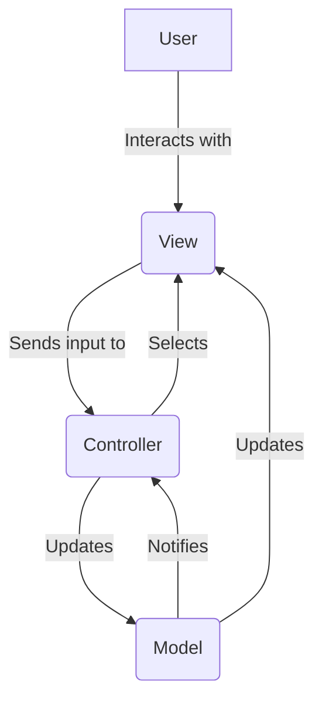

# DotNet-Lesson

## Chapitre 1 : Intro

.NET uniquement pour Windows à la base

Explosion du cloud = Framework opensource linux (.NET Core)

---

Commande pour lancer un programme .NET

*Template project .NET list*

```
dotnet new list
```

*Crée le projet .NET en structure mvc*

```
dotnet new mvc -n mvc -o mvcTemplate
```

*Pour lancer un programme .NET, on utilise le CLI et on entre la commande `dotnet run` dans le terminal*

```
dotnet run
```

Cette commande effectue la compilation, crée l'exécutable & lance le programme

Fichier en .csproj = Identité du projet, métadonnées & dépendances

Point d'entré du programme, Program.cs (=> main)

---

*Modèle MVC :*

<!--  -->



**Model :**

- Encapsule les données & la logique métier de l'application
- Indépendant de la présentation
- Peut inclure la validation des données & l'accès à la base de données

**View :**

- Responsable de la présentation des données à l'utilisateur

- Indépendant de la présentation

- Dans ASP.NET Core MVC, généralement écrit en Razor (mélange HTML & C#)

**Controller :**

- Reçoit les entrées de l'utilisateur

- Utilise les données fournies par le Model pour traiter les données

- Sélectionne la View appropriée & lui fournit les données nécessaires

### Avantage du pattern & Flux de données MVC

1 - Séparation des préoccupation (Trad Anglaise)

2 - 

---

**Classe :**

Une classe commence toujours avec une majuscule (Pascal Case)

Une classe = Un fichier

Pour faciliter la réutilisation (import/export) d'une classe en C# on utilise un NameSpace (Espace de nom)(def : contenant virtuel qui permet de faciliter l'import et l'export de code source)
Ex :

```
namespace mvc.Controllers;

public class HomeController : Controller
```

---

Properties = Setter & Getter intégré

Ex : 

```
public string? TestProperty{ get; set; }
```

Using = Directive permet d'importer les classes du namespace renseigné

Déclaration :

**Controller :**

Les controllers sont les cerveaux de l'app (vont chercher l'application et retourner les informations à l'utilisateur)

Les méthodes des controllers = Les actions

**Layout :**

Structure html mise en place

**LaunchSettings.json :**

Paramètres de lancement d'application


## Intro Interface

Syntaxe :

```
public interface INomInterface
{
    //Déclaration de méthodes &/ou propriétés
}
```

Exemple :

```
public interface IPersonne
{
    int Id { get; set; }
    string Nom { get; set; }
    int Age { get; set; }
    string ObtenirDescription();
}
```

```
public class Etudiant : IPersonne
{
    public int Id { get; set; }
    public string Nom { get; set; }
    public int Age { get; set; }
    public string Specialite { get; set; }

    public string ObtenirDescription()
    {
        return $"Étudiant: {Nom}, {Age} ans, enseigne {Matiere}";
    }
}
```

**Avantages des Interfaces :**

- Polymorphisme
- Extensibilité
- Découplage

```
List<IPersonne> personnes = new List<IPersonne>();
personnes.Add(new Etudiant { Nom = "Max", Age = 21, Specialite = "Informatique"});
personnes.Add(new Enseignant { Nom = "M. Vyes", Age = 23}, Matiere = "Mathématiques" )

foreach (var personne in personnes)
{
    Console.WriteLine(personne.ObtenirDescription());
}
```

## Ajout de dépendances dans un projet 

Site NuGet.org

Pomelo.EntityFrameworkCore.MySql

ORM permet d'effectuer des opérations en base de données (SELECT, UPDATE, etc...) en code C#

Gestion des tables de base de données directement au sein de l'application

EntityFrameworkCore.MySql & EntityFrameworkCore.Design

Création de classe permettant de récupérer les tables de la base de données

dotnet tool install --global dotnet-ef

*Faire une migration*
dotnet ef migrations add initialMagration

*Mise à jour de la bdd*
dotnet ef database update

Business Object = Objet métier (peut-être manipulé par un ORM)

Package Identity : Permet l'authentification et le blocage de certaines pages lorsque l'utilisateur n'est pas connecté